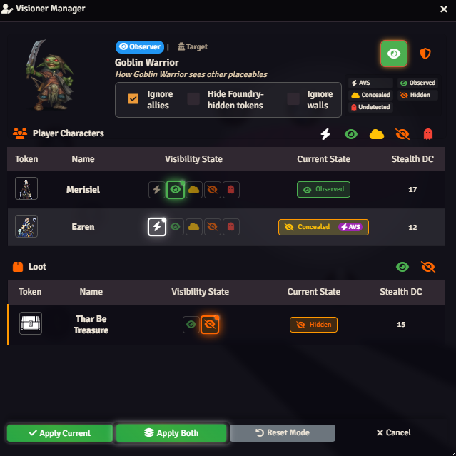
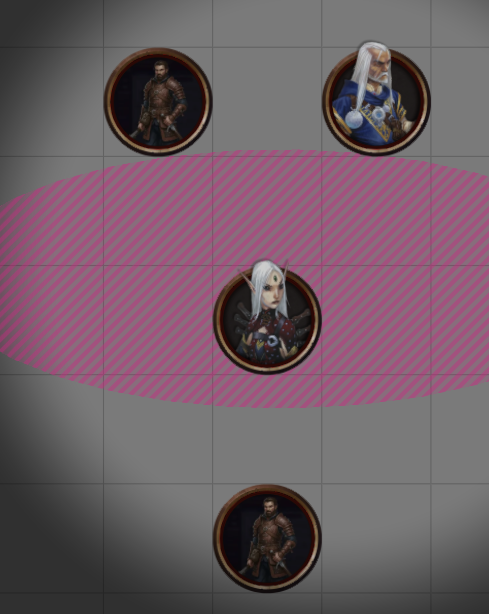
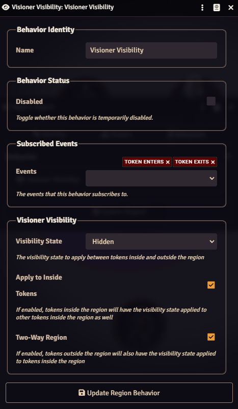
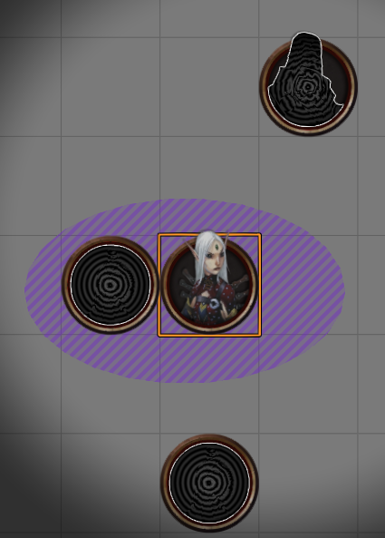
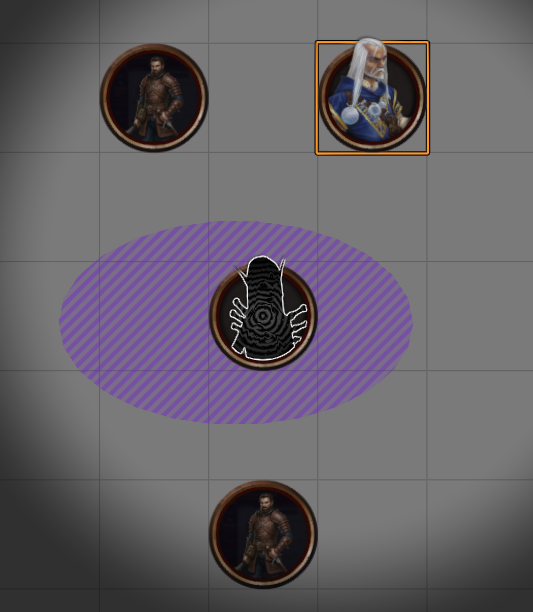

# Overview
AVS (Automatic Vision System) actually covers more than just vision. It is a comprehensive system for tracking observation between tokens based on a variety of environmental factors, effects and conditions, and senses. When AVS is active, users will still need to make manual adjustments, but AVS is designed to minimize the workload due to lighting, concealment regions, and other common ambient factors.

In the following example, AVS is active and being used to manage how the Goblin Warrior sees Erzen:

Lighting conditions, impairment to the sense used, or a region of concealment is rendering Erzen concealed to the Goblin. The lightning bolt icon in Visibility State column indicates that AVS is controlling the visibility state, and is subject to change as the position of either token or conditions on the scene change. Current state will indicate the state of observation that AVS has calculated, with a chip indicating that the state is being managed by AVS.

Merisiel, on the other hand, is manually set to Observed. Manual "overrides" are important and common even when AVS is enabled both for enforcing GM discretion, or because an action has been taken which influences observation outside the scope of ambient conditions. In order to turn control of the token pair back over to AVS, the GM will often use the [Change Validation Manager,](#change-validation-manager) which will prompt them to revert to AVS as tokens are moved or conditions change. 

>> [!NOTE]
>> In addition to relying on the validation manager's prompts, the GM may return observation control to AVS at any time from the Vision Manager by selecting the lighting bolt and clicking apply.

# AVS and the Senses
While a large focus of AVS is on perception through vision, AVS supports all pf2e senses to a degree (with full and automated support for every sense forthcoming.) When multiple precise senses are available, and one is impaired or deactivated, AVS will "use" the best functioning precise sense available. If no precise senses are available, AVS will fall back to imprecise senses applying RAW.

For example, a creature with precise echolocation will still "see" tokens as Observed even in darkness, through smoke or mist, or if blinded. The Foundry UI will reflect vision impairment, but the Visioner observation state will correctly remain observed for the sake of other module mechanics.

Several of the senses, such as tremorsense and lifesense, have their base system functionality extended in some way by AVS. The breadth of these improvements is beyond the scope if this page, but each will [have their own documentation here.](Senses.md)

# Lighting

Especially in cases where vision is an actor's main means of perception, lighting plays a key role in determining degrees of observation, and this is an area where AVS can be exceptionally helpful. Actors without low-light vision or darkvision will automatically see tokens that are in low light as concealed and tokens that are in unlit areas as hidden.  

MORE GOES HERE 

# Darkness

FILL IN

# AVS and Regions
**Visioner adds support for two types of region behavior to Foundry's existing region system:**

## AVS Concealment
AVS Concealment regions are areas that AVS can use to automatically apply concealment between tokens. Unlike most regions, AVS Concealment regions do not require region triggers (e.g. `Enter Region`) because, like magical darkness, they are detected by the module using ray casting. This allows the module to use regions of concealment that exist between tokens to apply concealment, even if neither token crosses their border. For users using AVS, this makes these regions ideal for smoke bombs, mist spells, and other areas of effect that conceal when viewed through.

In the above figure, a concealment region represents an area of mist. AVS reports the top two tokens as observed to one another. All other tokens are concealed from one another as they observe the others through the mist.

Concealment regions do not function as a hard override but instead interact with all other considerations the module makes. In the example above, if Merisiel (the token in the center of the region) were granted precise echolocation she would automatically observe all the tokens around her as Observed, and yet would remain concealed to all of them.

## Visioner Visibility
Visioner Visibility regions confer hard-overridden observation states between tokens within the region and tokens without. These regions require using Foundry [Scene Region Events](https://foundryvtt.com/article/scene-regions/#:~:text=information%20about%20them.-,Scene%20Region%20Events,-Behaviors%20can%20check) as triggers, the most common of which are `Token Enters` and `Token Exits`. 

In the region configuration window the following options are available:
- **Visibility State:** Select from one of the four major pf2e Observation States managed by Visioner (Observed, Concealed, Hidden, or Unobserved) to set a hard override the region should confer, or select AVS to automatically remove existing hard overrides.
- **Apply to Inside Tokens:** If enabled, tokens inside the region will have the selected Visibility State applied vs other tokens *inside* the region.
- **Two-Way Region:** If enabled, tokens outside the region will also have the visibility state applied vs token inside the region.

| Example Region Behavior | View from Inside Region | View from Outside Region |
| --- | --- | --- |
|  |  |  |