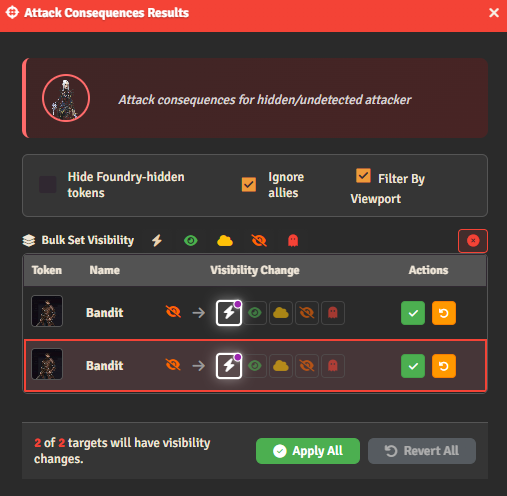
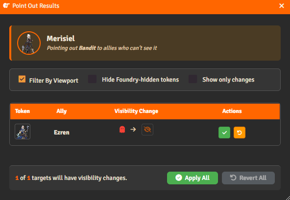
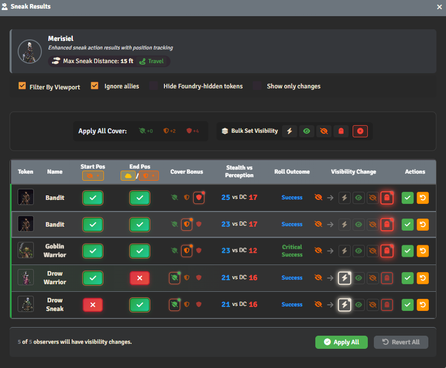

# Overview
PF2e Visioner adds functionality to the chat cards of several roll types and actions, tying vision state management in with the system. With the exception of Sneak and Seek, chat card callouts are exclusively visible to GM and Assistant GM user types.

Actions that produce a "Results" dialog, which allows the GM to exert discretion over recommended vision state changes, also generate an `Apply Changes` button, which accepts recommendations sight-unseen.

A description of the normal flow for each of these actions follows below; for information regarding how Pathfinder 2e feats and features modify some of the functionality described here, you may read about the feats we have hardcoded support for [here.](feats-features.md)

## Filters:
Each action dialog is able to filter results based on a number of criteria represented by checkboxes in the header of the window. **Token pairs that are filtered out from view are** ***not*** **acted upon when changes are applied.** Filters include:

| Filter | Description |
| --- | --- |
|**Hide Foundry-Hidden Tokens** | Tokens that have their visibility state toggled off by Foundry core are generally precluded from Visioner consideration in auto-cover and AVS, and may also be filtered from dialog boxes. This is particularly helpful on large maps with many tokens placed as Foundry-Hidden for setup.|
| **Ignore Allies** | Do not view or manipulate visibility states between allies (e.g. sneaking and becoming undetected by fellow party members.) |
| **Show Only Changes** | Filter out token-pair rows in the table in which the visibility state does not change. |
| **Show Only Encounter Tokens** | Filter out all tokens not in the current combat. |
| **Ignore Walls** ***(seek only)*** | Filter hidden walls and doors from seek results, and prevent the action from causing them to be discovered by the seeker. |

# Attack Consequences
When an actor `hidden` to or `undetected` by a target token attacks, they lose their advantageous visibility state by RAW. When a token makes an attack, Visioner injects a callout into the associated chat card so the GM is able to quickly adjust visibility accordingly: 

 

`Apply Changes` applies the default recommendations without opening the dialog. For most actions, that would mean accepting the visibility changes recommended based on RAW and auto-detected conditions. For Attack Consequences, the default behavior (with AVS turned on) would remove any forced visibility state like `hidden` or `undetected` and allow AVS to decide based on environmental conditions on the scene.

**Attack Consequences Dialog:**

> [!IMPORTANT]
> The Remove Overrides button displayed above exists conditionally when AVS is turned on. It is intended this is the default when playing with AVS, as it will remove visibility states from the target token. This means instead of forcing a visibility state of `observed` as a consequence of attacking, lighting conditions etc. Will still apply.
> In the absence of AVS, the recommendation will default to `observed` and the GM will need to account for ambient conditions manually before accepting* 

# Hide
The Hide results dialog includes columns that break down how visibility change recommendations are derived: 

- The level of cover between the token and each observer determines if a Stealth bonus is applied to the roll for that token pair. Cover is determined by the Auto-Cover system, through manually setting a value before the roll, or through a blanket override on the roll dialog for the action.
- Cover is also one factor in determining if the Hide action meets its RAW requirement of being performed with cover or concealment. If the action is taken with either standard cover or better, or while concealed from the observing token, the action "passes" this prerequisite. Visioner bases this off of cover and vision mappings on the token, or off of AVS and Auto Cover. GMs are able to manually toggle action prerequisites by clicking on the large green or red button. This will immediately qualify (or disqualify) the action and affect the recommended visibility change.
- Each token pair displayed will show the roll breakdown on its own line, as well as its own degree of success, as bonuses from cover may vary from token to token.
- In all action dialogs, visibility state changes are pre-highlighted with the system recommended value, but that value may be reassigned by the GM before accepting. 
- Each token-pair row may be approved individually or the GM may accept all changes

# Point Out

When a player targets a single creature they can see (as `hidden` or better) and uses point out, a dialog will become available to the GM to change other party members' perception of that creature from `undetected` to `hidden`. Instead of listing multiple targeted creatures, the dialog will list the allies to whom the change would apply.

# Seek
The Seek action will function slightly differently depending on the state of related module settings:
- If a template is being used, the roll chat will be injected with a user-interactable callout and button. This is visible to both the GM and the player, allowing them to place a template with a 15' radius with which to perform Seek:

    

     Once the template is set, the `Open Results` and `Apply Changes` buttons will become visible to the GM, as below.

- If, instead, a default distance is set in settings, results will automatically be bounded by that range from the token of origin and results will be available to the GM immediately:

    

**Opening the dialog yields a results window similar to those of other actions:**

The Seek results dialog differs in that the visibility states column changes how the acting token *perceives* the tokens listed, instead of affecting how they are perceived by them. 

In addition, Seek is particularly interesting because in addition to seeking to improve visibility on character tokens, Visioner provides using Seek on Loot Tokens and Hazards with a stealth DC, and even adds properties to hidden walls and doors to allow players to discover them with the Seek action. 

## Seeking for Loot and Hazard Tokens
Any token with a Stealth DC is potentially interactable with the Visioner Seek interface. Due to the technical limitations of needing to respect Foundry-Hidden tokens, loot actor tokens and hazards you wish to make discoverable through the action will need to be set up in advance:

1. Foundry visibility needs to be toggled on
2. In order to make the tokens not visible to players, Visioner visibility will need to be set to `unobserved` for all player owned tokens

Discoverable loot tokens with DC left blank will use a default DC that may be adjusted in settings.

## Seeking for Hidden Walls and Secret Doors
Visioner adds the ability to flag segments of hidden walls or doors with a DC for the seek template.

> [!NOTE]
> Please see [Wall Settings](wall-settings.md) for more information regarding setting up walls and secret doors for discovery using Seek.

# Sneak
Sneak undoubtedly has the most complex workflow of the actions enhanced by Visioner. 

When a sneak action is rolled, the chat card will be injected with a callout. This callout is visible to both the GM and the player, and includes a button for the player to click to begin their sneak movement, as well as a reminder of the maximum distance they may move while sneaking:

| Game Master View | Player View |
| --- | --- |
|  |  |

> [!IMPORTANT]
> Once a player rolls sneak, their movement is locked in place by an effect until `Start Sneak` is clicked to begin movement. If the action needs to be cancelled (e.g. because of a mis-click) the effect may be removed manually by the GM or the player.

Once the `Start Sneak` button is clicked, the player may move their token. While the sneak movement is in progress, an effect on the token informs the player and GM that the token is Foundry-Invisible to all other players. This applies both to allies and opposition. Once the sneak is completely resolved the token will reappear to players according to its Visioner visibility state.

**The Visioner callout disappears to the player, but changes for the GM as follows:**

Visioner determines that movement has ended when the GM uses `Open Sneak Results` or `Apply Changes` on the sneak chat card.

**Sneak Results Dialog:**

- Both start and end positions are tested for Sneak action requirements being met by AVS and Auto-Cover, if they are turned on. If either test fails, sneak cannot be performed against that token and the visibility state recommendation will be `observed`.
- Cover bonus should be applied to the roll if a degree of cover is maintained over the course of the entire movement, by RAW. Due to technical limitations and the likelihood that player paths may confuse the automation, cover bonus is currently manually applied by the GM.

> [!IMPORTANT]
> For AVS users: While a token is moving under Sneak, [AVS Override Manager](override-manager.md) treats that token as unobservable and will not prompt to remove overrides affecting it. Other tokens remain subject to AVS prompts as normal. If the sneaking token gains full line of sight to a hidden or unobserved token while moving, AVS Override Manager will still prompt the GM to decide whether the token should be revealed.