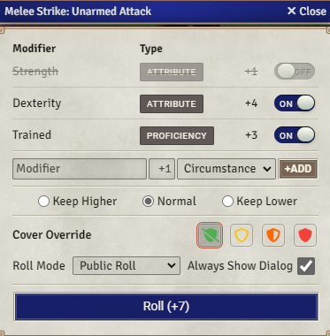

# Auto-Cover
Visioner uses a performant and flexible ray-casting algorithm to determine cover between tokens. Cover is granted by wall segments and other tokens. Because RAW provides guidelines for how cover is determined, but leaves much to GM discretion, Visioner's algorithm is customizable through settings, and provides easy opportunity for GMs and players to make overrides on the fly.

The way Visioner Auto-Cover system determines cover between tokens is highly configurable. For more information about the settings available to customize the Auto-Cover system, [see here](Settings.md#auto-cover-settings).

## Manually Overriding Cover from Wall Segments
The `Advanced Wall Settings` menu within the Visioner specific wall options allows for cover granted by specific wall segments to be manually adjusted. 

For more information about using Visioner's tools to customize wall segments [see here](Wall-Settings.md).

## Wall Height Support
>> [NOTE!]
>> Wall Height support may be released with 4.0.0 without documentation due to newness, or may be released at a later time

# Manual Cover Adjustments
**There are several places where manual adjustments to cover can be made:**
## Visioner Manager 
A cover tab exists in the [Visioner Manger](Visioner-Manager.md) allowing manual adjustments between token pairs, much like the observation states.

## Roll Dialogs
When making a roll where cover factors into a calculated bonus, the ability to quickly adjust cover appears on the roll dialog as follows:

In Roll Dialog cover overrides, the cover level calculated by the system will be preselected, but clicking on a different button overrides the cover passed to the system for the purpose of bonuses.

**Reminder:**
- For actions taken (such as attacks) where the cover of the target from the origin token impacts its AC, overriding to a greater level of cover will benefit the target.
- For actions taken (such as Hide) where the cover of the origin token from its targets impacts a bonus to the action roll, overriding to a greater level of cover will benefit the origin token.

## Cycle Token Cover

        

The cycle token cover button on the Token Controls is a quick way of overriding the level of cover an actor token ***grants.*** Auto cover is sophisticated enough to apply RAW regarding large tokens granting more cover than smaller tokens but this feature provides a way of accounting for GM fiat for particular tokens.