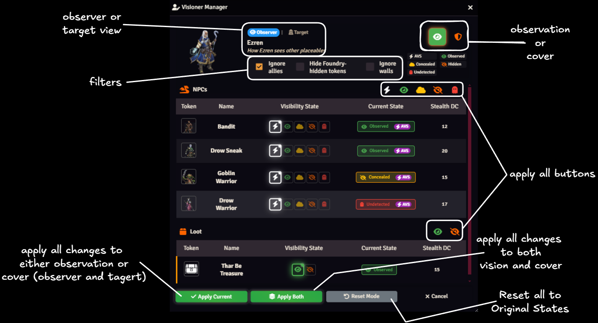

# Visioner Manager

The Visioner Manager provides a centralized location for GMs to manage token visibility and cover. Bring up the token manager by selecting any token and using the assigned hotkey (CTL+SHIFT+V by default).

Both visibility and cover states may be viewed and manipulated, and each of those either as the Observer or as the Target.

# Quick Edit

![Quick Edit Dialog]

The Quick edit dialog is a lightweight version of the Visioner Manager which provides for making rapid manual adjustments to vision or cover states. The dialog may be brought up using a UI button injected into the Token Controls of the Foundry sidebar: 

Alternatively, a hotkey may be assigned. You must select at least one token and one target.

Unlike the Visioner Manager, the Quick Edit Dialog cannot make individual changes between different *pairs* of tokens. A single vision or cover state is set between all selected tokens and all tokens that are targeted by the user in Foundry. This makes the dialog useful primarily for either batch changes (like a GM applying blanket concealment) or for quickly processing a single token pair's vision or cover.