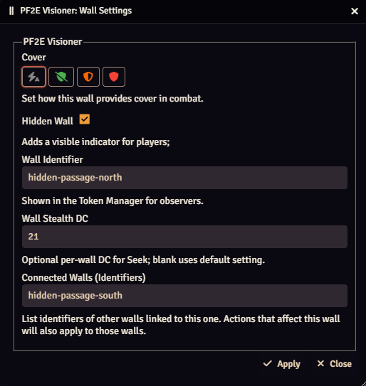
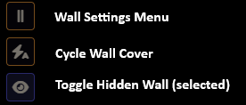
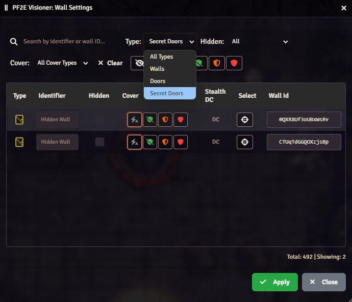

# Wall Settings

Wall segments opened using Foundry Wall Controls are granted a new Visioner-specific menu allowing you to set flags, such as making the wall hidden (discoverable through the [Seek action](Actions.md#seeking-for-hidden-walls-and-secret-doors),) setting a stealth DC, and specifying what degree of [cover](Auto‐Cover.md#walls-and-cover) the wall grants.

| Wall Settings | Description |
| --- | --- |
|  | **Cover:** Overrides the auto-cover system when the ray passes through a given segment, allowing you to force a degree of cover from that wall.    **Hidden Wall:** Toggling the wall as hidden marks it to Visioner as discoverable by the Seek action. Successful Seek rolls including that wall segment will highlight it with a luminescent PIXI overlay to the seeker, alerting them to the fact they have discovered a hidden wall or door.    **Wall Identifier:** Acts as a way for the GM to quickly identify and reference wall segments without needing to refer to their UUID. Wall identifiers can be used to chain discovery of one wall segment to another using connected walls (see below.)     **Stealth DC:** Allows each wall segment customized to have its own custom DC value. If left blank, the default DC specified in settings is used.     **Connected Walls:** Allows discovery of one wall segment to chain to other wall segments. Note that this relationship is one-way - to make the relationship two way you will need to also fill out the connected walls field on the other wall(s). |

Visioner also adds a full Wall Settings window, accessible through Foundry Wall Controls in the sidebar:

The full menu allows for quickly adding Visioner flags from a filterable list of all wall segments on the map:

